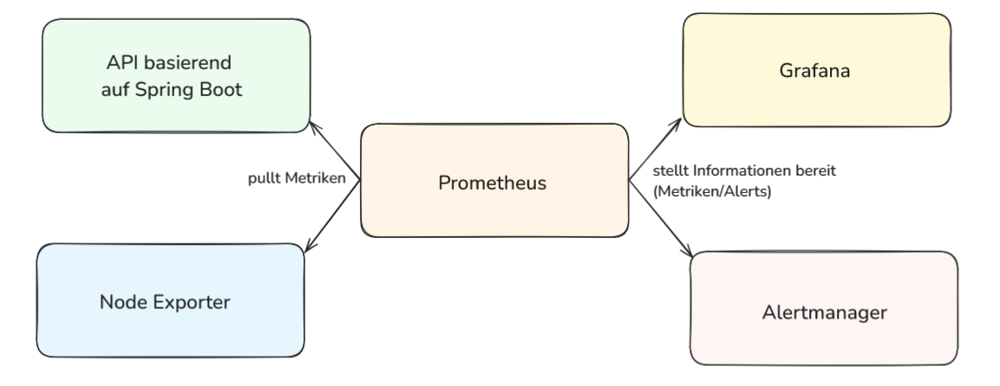

# Prometheus-Anwendungsbeispiel

## Inhaltsverzeichnis

1. [Projektinformationen](#projektinformationen)
2. [Voraussetzungen](#voraussetzungen)
3. [Anwendung](#anwendung)
    1. [Projekt starten](#projekt-starten)
    2. [Zugriff auf die Dienste](#zugriff-auf-die-dienste)
    3. [Nutzung der Monitoring-Features](#nutzung-der-monitoring-features)
4. [Service-Ansichten](#service-ansichten)
    1. [API](#api)
    2. [Grafana](#grafana)
    3. [Prometheus](#prometheus)
    4. [Alertmanager](#alertmanager)
    5. [Node Exporter](#node-exporter)

## Projektinformationen
Dieses Projekt zeigt den Einsatz von Prometheus als Monitoring- und Alarmsystem. Um die Funktionalität von Prometheus zu demonstrieren, wurde eine einfache Spring Boot-Anwendung implementiert, die Metriken bereitstellt und als Beispielziel dient.

#### Hauptkomponenten:

- Prometheus:
        Überwacht die Spring Boot-Anwendung und sammelt Metriken.
        Ermöglicht das Erstellen von Regeln für Alarme basierend auf den Metriken.
- Alertmanager:
        Benachrichtigt bei ausgelösten Alarmpunkten über Telegram.
- API basierend auf Spring Boot:
        Dient als Beispiel-Service, der Prometheus-kompatible Metriken bereitstellt.
- Node Exporter:
        Stellt Systemmetriken bereit, wie bspw. die CPU-Auslastung.
- Grafana:
        Visualisiert die von Prometheus gesammelten Daten in Dashboards.
- Docker Compose:
        Orchestriert die Container für eine einfache Bereitstellung.

## Voraussetzungen
Folgende Tools sollten vor dem Start der Anwendung installiert sein:

- Docker

Während der Entwicklung dieses Projekts wurden folgende Versionen verwendet:
- Docker version 27.3.1
- docker-compose version 1.29.2

## Anwendung

### Projekt starten
Im Root-Verzeichnis kann die Applikation mit dem Befehl `docker-compose up --build` gestartet werden. 

### Zugriff auf die Dienste
Unter folgenden URLs sind die Services erreichbar:

  -  API basierend auf Spring Boot: 
        - Get-Route: http://localhost:8080/api/metrics-test
        - Error-Route: http://localhost:8080/api/error
  -  Grafana: http://localhost:3000/dashboards (Standardlogin: admin/admin)
  -  Prometheus: http://localhost:9090
  -  Alertmanager: http://localhost:9093
  -  NodeExporter: http://localhost:9100
  - Telegram-Bot: https://t.me/dbs_prometheus_alert_bot

### Nutzung der Monitoring-Features
1. Telegram-Bot aktivieren
   - Hierfür wird der bereitgestellte Link aufgerufen, und die Interaktion mit dem Bot gestartet.

2. Endpunkte aufrufen
   - Rufen Sie den Endpunkt `/metrics-test` auf, um Metriken zu sammeln.
   - Rufen Sie den Endpunkt `/error` auf, um einen Alert auszulösen (wiederholter Aufruf führt zur Auslösung des Alerts).

3. Alert in Prometheus einsehen
   - Gehen Sie zur Prometheus Web UI und navigieren Sie zum Reiter `Alerts`.
   - Aktualisieren Sie die Seite und beobachten Sie, dass der Status des Alerts auf `firing` gesetzt wird.
4. Benachrichtigungen im Alertmanager
   - Der Alert sollte im Alertmanager angezeigt.
   - Der Alertmanager benachrichtigt den Bot und kurz nach der Auslösung des Alerts wird eine Nachricht mit der Alertmeldung durch den Bot gesendet.
5. Dashboards in Grafana anzeigen
   - Öffnen Sie Grafana und navigieren Sie zum Reiter `Dashboards`.
   - Sobald einige Daten gesammelt wurden, werden diese in den vorkonfigurierten Dashboards angezeigt.
   - Bei Bedarf können neue Dashboards erstellt und zusätzliche Metriken integriert werden.
6. Metriken im Node Exporter einsehen
   - Im Node Exporter können unter dem Reiter `Metriken` alle verfügbaren Metriken angezeigt werden, die vom Node Exporter bereitgestellt werden.

#### Hinweis:
In Prometheus wird der Alert weiterhin mit dem Status `firing` gelistet. Dies ist normal, da Prometheus den Alert erst dann als gelöst markiert, wenn die Alertregel nicht mehr greift. Die Regel ist so definiert, dass ein Alert ausgelöst wird, sobald der Endpunkt mehr als einmal aufgerufen wurde. Um das System zurückzusetzen, müssen die Container gestoppt und neu gestartet werden.  

## Service-Ansichten
In diesem Abschnitt werden Abbildungen der einzelnen Dienste bereitgestellt, um eine visuelle Orientierung zu ermöglichen, wie das Projekt nach dem Start und der erfolgreichen Inbetriebnahme erscheint.
### API
Endpunkte der API:

### Grafana
Vorkonfigurierte Grafana-Dashboards:

### Prometheus
In der Web UI von Prometheus sind die eingerichteten Alerts zu sehen.

Inaktiver Alert:

Aktiver Alert (firing):

### Alertmanager
Alertmanager ohne ausgelöste Alerts:

Alertmanager mit Alert:

### Node Exporter

