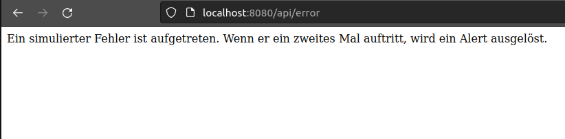

# Prometheus-Anwendungsbeispiel

## Projektinformationen
Dieses Projekt zeigt den Einsatz von Prometheus als Monitoring- und Alarmsystem. Um die Funktionalität von Prometheus zu demonstrieren, wurde eine einfache Spring Boot-Anwendung implementiert, die Metriken bereitstellt und als Beispielziel dient.

#### Hauptkomponenten:

- Prometheus:
        Überwacht die Spring Boot-Anwendung und sammelt Metriken.
        Ermöglicht das Erstellen von Regeln für Alarme basierend auf den Metriken.
- Alertmanager:
        Benachrichtigt bei ausgelösten Alarmpunkten über Telegram.
- Spring Boot-Anwendung:
        Dient als Beispiel-Service, der Prometheus-kompatible Metriken bereitstellt.
- Node Exporter:
        Stellt Systemmetriken bereit, wie bspw. die CPU-Auslastung.
- Grafana:
        Visualisiert die von Prometheus gesammelten Daten in Dashboards.
- Docker Compose:
        Orchestriert die Container für eine einfache Bereitstellung.

## Voraussetzungen
Folgende Tools sollten vor dem Start der Anwendung installiert sein:

- Docker

Während der Entwicklung dieses Projekt wurden folgende Versionen verwendet:
- Docker version 27.3.1
- docker-compose version 1.29.2

## Anwendung

### Projekt starten
Im Root-Verzeichnis kann die Applikation mit dem Befehl `docker-compose up --build` gestartet werden. 

### Zugriff auf die Dienste
Unter folgenden URLs sind die Services erreichbar:

  -  API basierend auf Spring Boot: 
        - Get-Route: http://localhost:8080/api/metrics-test
        - Error-Route: http://localhost:8080/api/error
  -  Grafana: http://localhost:3000/dashboards (Standardlogin: admin/admin)
  -  Prometheus: http://localhost:9090
  -  Alertmanager: http://localhost:9093
  -  NodeExporter: http://localhost:9100
  - Telegram Alert-Bot: https://t.me/dbs_prometheus_alert_bot

## Endprodukt
### API
Die Routen der API sehen wie folgt aus:

### Grafana
Die Seite der vorkonfigurierten Grafana-Dashboards sehen so aus:

### Prometheus
In der Web UI von Prometheus sind die eingerichteten Alerts zu sehen:
So sieht ein inaktiver Alert aus:

So sieht ein Alert aus, der ausgelöst wurde:

### Alertmanager
Alertmanager ohne ausgelöste Alerts:

Alertmanager mit Alerts:

### Node Exporter

